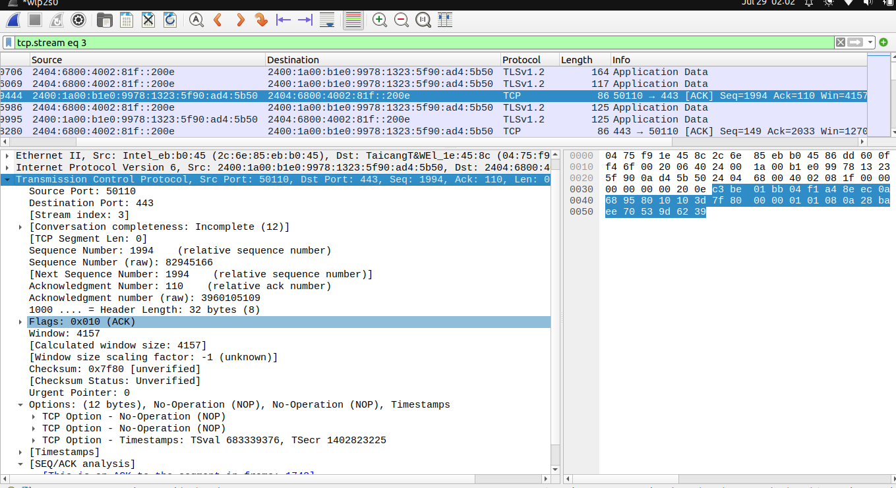

We know TCP header contains 10 mandatory field and 2 optional field.The value of each field and their meaning
is given below:

1) Source Port : 
   Value = 0xe135 or (50110) 
   Source Port field with a value of 50110 in the TCP header indicates that the sending application is using 
   port 50110 to communicate with the receiving host.The port number falls under Dynamic or Private port. 

2) Destination Port: 
   Value = 0x01bb or (443) 
   It indicates that the data is intended for the HTTPS service on the receiving host. This port number allows
   the receiving host to forward the data to the appropriate application that can handle HTTPS traffic,
   ensuring secure communication between the client and server.

3) Sequence Number :
   Value = 1994 (Relative Sequence Number ) ,82945166 (Absolute Sequence Number) 
   The relative sequence number is displayed as 1 to indicate the first byte of data after the Initial Sequence
   Number. The absolute sequence number is the actual value found in the TCP header, which is
   82945166 in this case.This approach simplifies the tracking of packets sent in a TCP stream for
   users analyzing the data.

4) Acknowledgment number : 
   Value = 110 (Relative Acknowledgment number ) , 3960105109(Absolute Acknowledgment number ) 
   The value 3960105109 in the acknowledgment number field indicates that the receiver has successfully received 3960105109 all bytes.
   The relative acknowledgment number of 110 simplifies this to indicate that it is
   the first byte expected after the initial sequence.

5) Data Offset : 
   Value = 0x8 (1000 in binary ) 
   The value indicates that the TCP header is 32 bytes long, and the actual data payload begins after these 32
   bytes.

6) Reserved : 
   Value = 0  
   As we know , when the field is not used then value 0 must be there to indicate that nothing is reserved. 
   If reserved then, the value must be from 0 to 15 . 

7) Flags: 
   Value= 0x018 
   Converting into binary 0000 0001 1000 , the first 4 msb is of the Reserved field. 
   The next 8 bit indicates the different flags . 
   It means ACK and PSH flags are on .
   The ACK flag tells us that the Acknowledgement field is significant.
   The PSH flag indicate that the receiver should pass this data to the application as soon as possible.

8) Window Size : 
   Value= 0x103d or (4157 in decimal ) 
   The value indicates that the receiver can currently accept up to 4157 bytes of data from the sender. 

9) Checksum : 
   Value= 0x7f80
   The value indicates the result of the checksum computation for that particular TCP segment is 0x7f80, which
   is used to check the if error has occured while sending the packet.

10)Urgent Pointer: 
   Value=0x0000
   The value  indicates that the segment does not contain any urgent data and the URG flag is not active for
   that segment.As we saw earlier only ACK and PSH flag is active. 

11)Options: 
   Value=0x0101080a539d623a28baedff
   0x01 is a NOP (No-Operation) option for padding.
   0x08 indicates a Timestamp option with a length of 10 bytes.
   0x539d623a is the Timestamp value.
   0x28baedff is the Timestamp Echo Reply value.

This particular packet has the size of 0 bytes TCP payload. 
