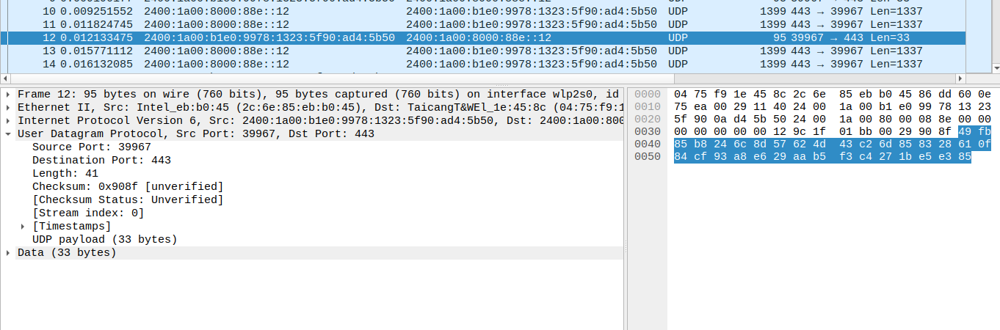

We know UDP header contains 4 fields. The value of each field and their meaning is given below. 

1) Source Port Number : 
                        Value = 0x9c1f or (39967 in decimal) 
                        It means that that the data was sent from a source port 39967 assigned by operating 
                        system. 

2) Destination Port Number :
                        Value = 0x01bb or (443 in decimal) 
					    A destination port number of 443 usually indicates that the packet is intended for
					    a service that uses secure communication, and in the context of UDP, it might be
						used for modern protocols that require secure and efficient data transport.
                         
3) Length: 
          Value= 0x0029 or(41 in decimal) 
          The value 41 means that total size of packet including is 41 and subtracting the header size we get 
		  33 which is the size of actual data. The value 33 can be seen on the screenshot as the UDP payload . 

4) Checksum: 
            Value= 0x908f
			It is the value which is used to check if the data is changed or not. 

